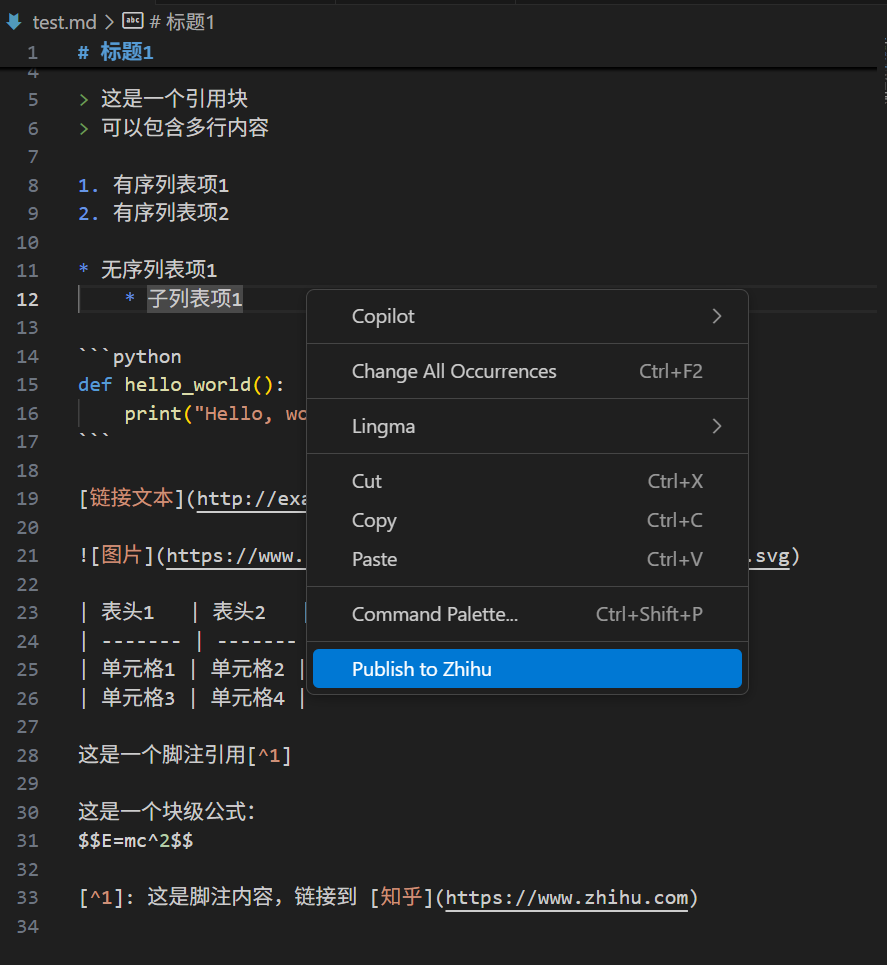

# zhihu-publisher-vscode README

This is the README for extension "zhihu-publisher-vscode". 

## Features

This extension does the following:
 - publish markdown file to zhihu
 - update article to zhihu
 - delete article from zhihu
 - build article map to manage your articles

like this:


## Requirements

```
    "axios": "^1.4.0",
    "cheerio": "^1.0.0-rc.12",
    "form-data": "^4.0.0"
```

## Extension Settings

Please setting your zhihu cookie in settings.json

## Known Issues

Calling out known issues can help limit users opening duplicate issues against your extension.

## Release Notes

Users appreciate release notes as you update your extension.

### 1.2.1
- Add feature: support upload image

---

## Dev
welcome to contribute and fork me
**[Github](https://github.com/jack-base/zhihu-publisher-vscode)**

**Enjoy!**
