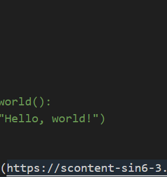

# 标题1

这是一段普通文本，包含**粗体**和*斜体*。

> 这是一个引用块
> 可以包含多行内容

1. 列表项1
2. 列表项2


```python
def hello_world():
    print("Hello, world!")
```

[链接文本](http://example.com)



| 表头1   | 表头2   |
| ------- | ------- |
| 单元格1 | 单元格2 |
| 单元格3 | 单元格4 |

这是一个脚注引用[^1]

这是一个块级公式：

$$
E=mc^2
$$

这是一个行级公式：$E=mc^2$

[^1]: 这是脚注内容，链接到 [知乎](https://www.zhihu.com)
